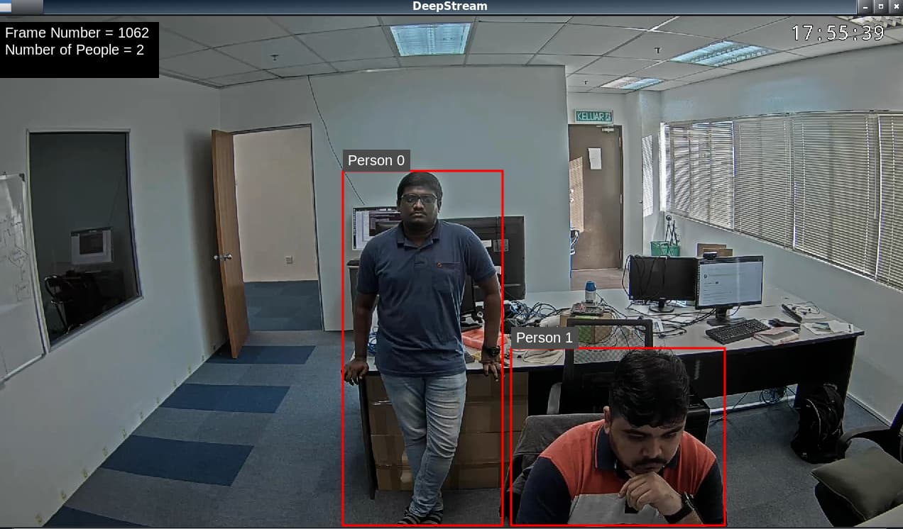

# PeopleNet – Real-Time Human Detection with NVIDIA



## 📌 Overview
**PeopleNet** is an AI model developed by **NVIDIA** for real-time human detection in images and video streams. It is widely used for **smart cities, retail analytics, workplace safety, and autonomous systems**. Unlike general-purpose object detectors, PeopleNet is optimized for detecting **people in diverse environments**, offering **high accuracy and low latency** with support for edge deployment on **Jetson devices** and high-performance inference on **NVIDIA GPUs**.

This repository demonstrates how to set up, run, and customize PeopleNet for your own applications.  

---

## 🚀 Features
- **Real-time person detection** (supports crowded scenes, occlusions, variable lighting).  
- **Optimized for NVIDIA GPUs** (TensorRT, DeepStream).  
- **Supports multiple input sources** (camera, video, RTSP streams).  
- **Scalable** – from embedded Jetson devices to enterprise datacenter GPUs.  
- **Pre-trained weights** available via NVIDIA NGC.  
- **Custom training** supported with TAO Toolkit.  

---

## 🛠️ Installation

### 1. Clone Repository
```bash
git clone https://github.com/your-username/peoplenet-demo.git
cd peoplenet-demo
